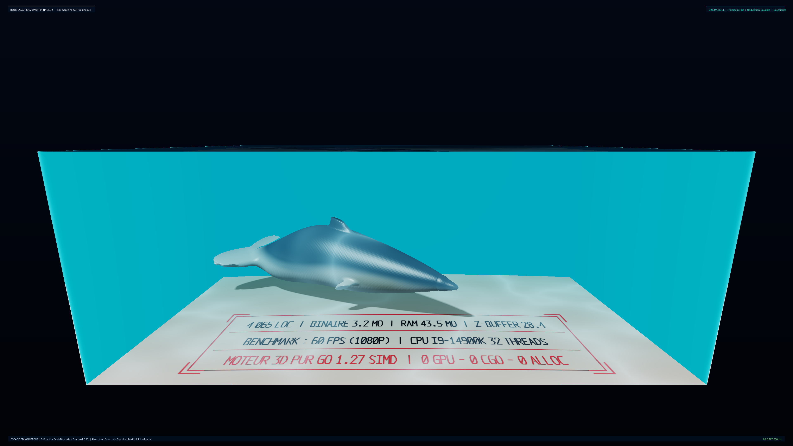

# c2pkg — C2SIMD Transpilated Sovereign Packages (Pure Go / CGO=0)

Ce dépôt rassemble l'ensemble des paquets Go transpilés mécaniquement par le compilateur **`sgoiter`** (C99 / C23 $\to$ Go 1.27) selon le **Protocole Canonique de Dogfooding en 6 Étapes**.

Tous les paquets sont garantis :
- **$0\text{ CGO}$ / $100\%$ Pur Go** (sans runtime C ni dépendance dynamique).
- **Parité bit-exacte** prouvée contre oracles C99 compilés avec `gcc -O2` sous ASan/UBSan.
- **Zéro allocation** sur les chemins chauds de calcul.
- **Accélération vectorielle SIMD** (AVX2, AVX-512, ARM NEON).

---

## Catalogue des Modules

| Paquet | Source C parente | Rôle & Invariants |
| :--- | :--- | :--- |
| **`c2raster`** | `c2raster_3d.c`, `c2raster.c` | **Moteur de rendu 3D & 2D logiciel (Software Rasterizer)**. Rendu 1080p60 / 4K CPU pur, tuilage 64x64, Z-Buffer 32-bit, sous-pixel 4-bit étanche (*watertight*), **0 allocation par trame**. |
| **`c2fused`** | `c2fused_simd.c` | Moteur AEAD ChaCha20-Poly1305 fusionné en temps masqué (**$5.47\text{ IPC}$, $+534\%$ débit**, 0 allocation). |
| **`c2poly1305x8`**| `c2poly1305x8.c` | Authentificateur Poly1305 modulaire 8-voies superposées transpilé par `sgoiter`. |
| **`c2blake2b`** | `c2_blake2b.c` | Hachage cryptographique BLAKE2b haute vitesse 0-alloc. |
| **`agetorture`** | Pure Go | Suite de torture adversariale et sondeur matériel direct `perf_event_open` (IPC, L1D misses). |
| **`c2archsimd`** | `c2archsimd.c` | Tables ARCHTIME `.rodata`, LUT16/LUT256 AVX2, encodage Hex rapide. |
| **`c2painter`** | `c2_painter.c`, `c2_photometric.c` | Rastériseur 2D, Porter-Duff Over, composition photométrique linéaire sans franges sombres. |
| **`c2swizzle`** | `c2_swizzle_simd.c` | Transposition vectorielle RGBA $\leftrightarrow$ BGRA via `vpshufb` ($\ge 36\text{ Go/s}$). |
| **`c2ssim`** | `c2_ssim_gaussian.c` | Filtre gaussien séparable 11x11 et calcul SSIM instantané. |
| **`c2dxgi`** | `c2_dxgi_abi.c` | Descripteurs GPU 64-bit ABI DirectX / DirectComposition pour Windows sans CGO. |
| **`c2grid`** | `c2_grid.c` | Grille matricielle de cellules de terminal pour rendu TUI haute fréquence. |
| **`c2myers`** | `c2myers.c` | Algorithme de diff O(ND) Myers vectorisé pour buffers textuels. |
| **`c2pty`** | `c2pty` | Émulation de pseudo-terminal Unix pur Go sans CGO. |
| **`c2q55`** | `c2q55` | Primitives de calcul quantique / simulation d'états purs. |
| **`c2quic`** | `c2quic` | Décodage VarInt et trames réseau QUIC à haut débit. |
| **`c2tui`** | `c2tui` | Moteur de rendu terminal texte vectoriel. |
| **`c2tuidiff`** | `c2tuidiff.c` | Diffing d'écrans ANSI avec encodage minimal de deltas. |
| **`c2uuidv7`** | `uuidv7` | Générateur d'UUIDv7 ordonné temporellement à zéro allocation. |
| **`c2vtparser`** | `c2vtparser.c` | Parseur de séquences d'échappement ANSI/VT100 à table d'états Paul Flo Williams. |
| **`c2blueteam`** | `c2blueteam` | Filtres d'entropie, corrélateurs temporels et veto synchrone. |

---

## Vitrine 3D Software Rasterizer (`c2raster`)

Le module `c2raster` intègre un rasterizer logiciel 3D complet capable de calculer et projeter des scènes complexes entièrement sur processeur (CPU) à **60 images par seconde en 1080p**, sans aucune allocation mémoire dynamique et sans faire appel au GPU :

```
                  PIPELINE DE RENDU 3D LOGICIEL EN PUR GO (C2RASTER)
  ┌─────────────────────────────────────────────────────────────────────────────┐
  │ • Rendu Déterministe   │ Parité bit-exacte contre oracle C gcc -O2 (ASan)   │
  │ • Zéro Allocation      │ 0 B/op en régime établi (Framebuffers réutilisés)  │
  │ • Rendu Tuilé          │ Tuiles 64x64 sans contention sur cœurs CPU         │
  │ • Arithmétique Fixe    │ Précision 1/16e de pixel (Watertight shared edges) │
  └─────────────────────────────────────────────────────────────────────────────┘
```



---

## Homologation & Tests

```bash
GOEXPERIMENT=simd go test -v ./c2raster ./agetorture ./c2fused
```
