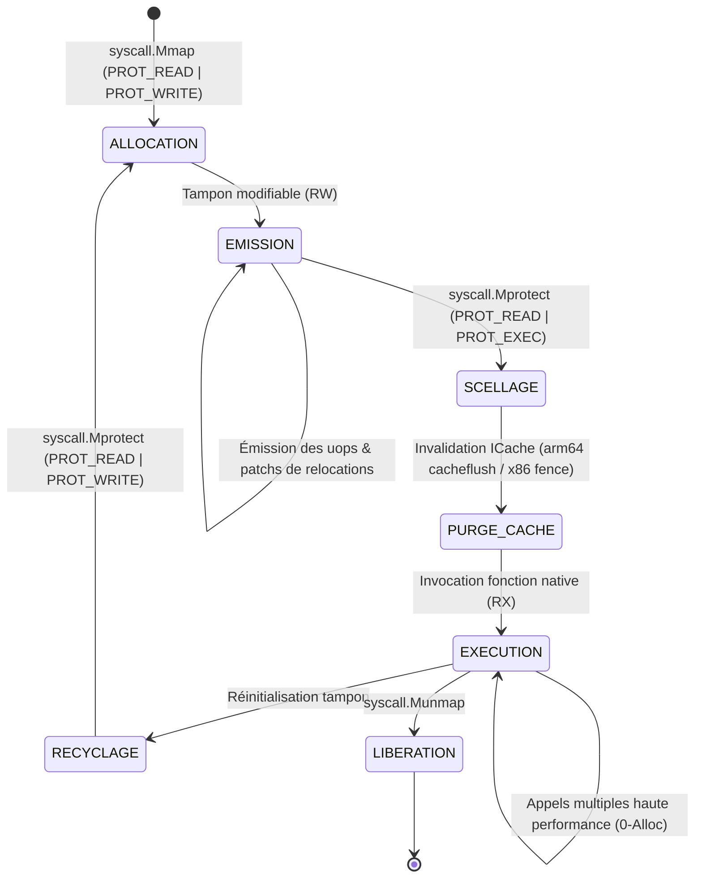

# DIRECTIVES — c2pkg/c2jit

**ID HPM55 :** `01a03f07-031e-7c30-8381-43d5447b1ad1`  
**Parent HPM55 :** `019fd633-6735-705c-8c57-e09608dca298` (`c2simd`)  
**Intention :** Micro-assembleur de code machine dynamique JIT AVX2 / x86-64 / ARM64 Neon pur Go (zéro CGO, allocation mémoire exécutable sous cycle W^X déterministe, issu de micro-assembleurs C99 de référence transpilés par `sgoiter`) pour la compilation et l'exécution sans surcoût de boucles chaudes, filtres et automates vectoriels.

---

## 1. Principes Fondateurs & Cadre Doctrinal ARCHTIME

1. **Zéro CGO & Pur Go :** Le paquet constitue un moteur autonome d'émission d'instructions machine écrit exclusivement en pur Go 1.27 (`GOEXPERIMENT=simd`). Aucune dépendance vers `cgo`, `glibc`, `libgcc` ou un compilateur C externe n'est autorisée lors de l'exécution en production.
2. **Autorité Déclarative CUE (ARCHTIME) :** La totalité des tables d'encodage d'instructions (opcodes, préfixes REX/VEX, formats ModR/M et SIB, masques de registres) est spécifiée dans des schémas CUE clos ([`sgoiter/spec/`](file:///devhoros/c2simd/sgoiter/spec/)). Ces schémas sont validés par `cue vet` et aplatis en tables constantes `rodata` Go avant la compilation via `cmd/cuegen`. Aucun arbre de décision dynamique ou découverte au runtime n'est toléré.
3. **Origine C99 & Transpilation sgoiter :** Le moteur d'émission procède de la transpilation mécanique par [`sgoiter`](file:///devhoros/c2simd/sgoiter/) de bibliothèques C99 unitaire de micro-assemblage reconnues :
   - *DynASM (LuaJIT, Mike Pall) :* Format de bytecode d'actions, préprocesseur et moteur compact de résolution des sauts et labels relatifs/PC.
   - *SLJIT (PCRE2, Zoltan Herczeg) :* Abstraction unifiée des registres virtuels et abaissement multi-architecture (x86-64 et ARM64).
   - *MIR (Vladimir Makarov) :* Modèles de sélection d'instructions et d'encodage optimisé pour pipelines modernes.
4. **Parité Bit-Exacte Oracle GCC `-O2` :** Chaque instruction machine émise et chaque séquence de bytecode exécutée fait l'objet d'une validation contre un oracle binaire compilé avec `gcc -O2` (`TestJITVsCOracle`), couplé à un contrôle négatif obligatoire issu de [`c2oracle`](file:///devhoros/c2simd/c2pkg/c2oracle/oracle.go).
5. **Zéro Allocation au Runtime :** L'émission et l'appel de fonctions JIT compilées ne déclenchent aucune allocation sur le tas de la mémoire managée Go (`b.ReportAllocs()` égal à 0).

---

## 2. Analyse Technique & État de l'Art Comparatif

Le paquet `c2jit` s'appuie sur une synthèse architecturale des trois micro-assembleurs dynamiques C99 de référence, adaptée aux contraintes strictes du runtime Go :

```
┌─────────────────────────────────────────────────────────────────────────┐
│                      Micro-assembleurs C99 de Référence                 │
├───────────────────┬─────────────────────────┬───────────────────────────┤
│ DynASM (LuaJIT)   │ SLJIT (PCRE2)           │ MIR (Makarov)             │
│ • Bytecode compact│ • Registres virtuels    │ • IR 3-adresses & SSA     │
│ • Macro-templates │ • Gestion W^X intégrée  │ • Encodages vectoriels    │
│ • Résolution PC   │ • Portabilité x86/ARM   │ • Ordonnancement uops     │
└─────────┬─────────┴────────────┬────────────┴─────────────┬─────────────┘
          │                      │                          │
          └──────────────────────┼──────────────────────────┘
                                 ▼
                     Transpilation via sgoiter
                                 ▼
┌─────────────────────────────────────────────────────────────────────────┐
│                     Moteur c2jit (Pur Go 1.27)                          │
├─────────────────────────────────────────────────────────────────────────┤
│ 1. Tables CUE statiques (ARCHTIME rodata)                               │
│ 2. Émetteur x86-64 / AVX2 & ARM64 Neon                                  │
│ 3. Cycle de sécurité mémoire W^X (Mmap -> Write -> Mprotect -> Exec)   │
│ 4. Pont ABI zéro surcoût (préservation registre Goroutine 'g')          │
└─────────────────────────────────────────────────────────────────────────┘
```

| Propriété | DynASM (LuaJIT) | SLJIT (PCRE2) | MIR (Makarov) | c2jit (Spécification HPM55) |
| :--- | :--- | :--- | :--- | :--- |
| **Poids & Dépendances** | Ultra-léger (2 fichiers C) | Moyen (10k+ lignes C) | Lourd (compilateur complet) | Pur Go 1.27, zéro CGO, zéro dépendance |
| **Modèle d'Émission** | Linéaire dirigé par templates | Machine abstraite multi-registres | Générateur SSA multi-passes | Linéaire direct avec patch de labels relatifs |
| **Sécurité Mémoire** | Exécute en mémoire RWX libre | Gestionnaire de pages W^X | Mmap double ou mprotect | Cycle W^X strict avec pages de garde `PROT_NONE` |
| **Intégration Go** | Incompatible sans wrapper C | Incompatible sans wrapper C | Incompatible sans wrapper C | Appel direct via `unsafe.Pointer` sans split de pile |

---

## 3. Spécifications Formelles de l'ABI & Conventions de Registres

### 3.1. Prise en Compte des Spécificités du Runtime Go

L'exécution de code machine arbitraire au sein d'un processus Go requiert la conformité absolue avec les invariants du runtime :
1. **Intégrité du Pointeur de Goroutine (`g`) :**
   - Sur **x86-64 (amd64)**, le registre `R14` héberge le pointeur de la goroutine courante (`g`). Il est **STRICTEMENT INTERDIT** d'écrire dans `R14` ou de l'utiliser comme registre temporaire.
   - Sur **ARM64 (arm64)**, le registre `R28` héberge le pointeur `g`. Il est **STRICTEMENT INTERDIT** d'écrire dans `R28`.
2. **Alignement et Contrôle de Pile :**
   - La pile doit être alignée sur une frontière de 16 octets avant toute instruction `CALL`.
   - Les fonctions JIT ne doivent pas provoquer de dépassement de pile (*stack split*) ni invoquer de point de préemption non coopératif Go (`asyncPreempt`).
3. **Pointeur de Trame (*Frame Pointer*) :**
   - La préservation du registre `RBP` (x86-64) ou `FP / X29` (ARM64) est obligatoire en prologue et épilogue afin de préserver la traçabilité des piles d'appels lors de l'échantillonnage de profils CPU (`pprof`).

### 3.2. Cartographie des Registres sous Architecture x86-64

La convention d'appel par défaut du code généré pour x86-64 respecte la convention standard System V AMD64 ABI, tout en appliquant les restrictions Go :

```
x86-64 Register Allocation Matrix:
┌──────────┬──────────────┬────────────────────────┬────────────────────────┐
│ Registre │ Classification│ Rôle Standard System V │ Contrainte c2jit / Go  │
├──────────┼──────────────┼────────────────────────┼────────────────────────┤
│ RAX      │ Scratch / Ret│ Valeur de retour 1     │ Utilisable librement   │
│ RDX      │ Scratch / Ret│ Valeur de retour 2 / 3e arg │ Utilisable librement │
│ RDI      │ Scratch / Arg│ 1er argument entier     │ Utilisable librement   │
│ RSI      │ Scratch / Arg│ 2e argument entier     │ Utilisable librement   │
│ RCX      │ Scratch / Arg│ 4e argument entier     │ Utilisable librement   │
│ R8       │ Scratch / Arg│ 5e argument entier     │ Utilisable librement   │
│ R9       │ Scratch / Arg│ 6e argument entier     │ Utilisable librement   │
│ R10, R11 │ Scratch      │ Temporaires chaîne/appel│ Utilisable librement   │
│ RBX      │ Callee-saved │ Préservé par l'appelé  │ Sauvegarde obligatoire │
│ RSP      │ Callee-saved │ Pointeur de pile       │ Gestion stricte align 16│
│ RBP      │ Callee-saved │ Pointeur de trame      │ Prologue: PUSH RBP; MOV RBP,RSP │
│ R12, R13 │ Callee-saved │ Préservé par l'appelé  │ Sauvegarde obligatoire │
│ R14      │ SANCTUARISÉ  │ Pointeur Go Goroutine  │ LECTURE SEULE / INTERDIT D'ÉCRITURE │
│ R15      │ Callee-saved │ Registre m runtime Go  │ Sauvegarde obligatoire │
│ YMM0..7  │ Scratch / Arg│ Arguments vectoriels   │ Utilisable librement   │
│ YMM8..15 │ Scratch      │ Registres vectoriels   │ Utilisable librement   │
└──────────┴──────────────┴────────────────────────┴────────────────────────┘
```

### 3.3. Cartographie des Registres sous Architecture ARM64 (AArch64)

La convention d'appel respecte le standard AAPCS64 :

```
ARM64 (AArch64) Register Allocation Matrix:
┌──────────┬──────────────┬────────────────────────┬────────────────────────┐
│ Registre │ Classification│ Rôle Standard AAPCS64  │ Contrainte c2jit / Go  │
├──────────┼──────────────┼────────────────────────┼────────────────────────┤
│ X0..X7   │ Scratch / Arg│ Arguments 1 à 8 / Ret  │ Utilisable librement   │
│ X8       │ Scratch      │ Adresse retour structure│ Utilisable librement   │
│ X9..X15  │ Scratch      │ Registres temporaires  │ Utilisable librement   │
│ X16, X17 │ Scratch (IP) │ Registres intra-procédure│ Utilisable librement │
│ X18      │ Réservé      │ Plateforme (TLS/Shadow)│ Ne pas écraser         │
│ X19..X27 │ Callee-saved │ Préservés par l'appelé │ Sauvegarde obligatoire │
│ X28      │ SANCTUARISÉ  │ Pointeur Go Goroutine  │ LECTURE SEULE / INTERDIT D'ÉCRITURE │
│ X29 (FP) │ Callee-saved │ Pointeur de trame      │ Sauvegardé en prologue │
│ X30 (LR) │ Callee-saved │ Adresse de retour      │ Sauvegardé en prologue │
│ SP       │ Callee-saved │ Pointeur de pile       │ Alignement 16 octets   │
│ V0..V7   │ Scratch / Arg│ Arguments SIMD Neon / Ret│ Utilisable librement │
│ V8..V15  │ Callee-saved │ SIMD bas (64-bit sauv.)│ Sauvegarde bas si muté │
│ V16..V31 │ Scratch      │ SIMD temporaires       │ Utilisable librement   │
└──────────┴──────────────┴────────────────────────┴────────────────────────┘
```

---

## 4. Table Fermée des Micro-Opérations (uops) & Encodages Supportés

Toutes les micro-opérations sont univoques et correspondent à un encodage machine vérifié sans ambiguïté :

### 4.1. Instructions Scalaires Arithmétiques & Logiques (ALU 64-bit)

| Micro-opération (uop) | Architecture | Sémantique & Opérandes | Encodage Canonique (Hex / Structure) |
| :--- | :--- | :--- | :--- |
| `UOP_NOP` | x86-64 | Instruction sans effet | `0x90` (ou séquences multi-octets NOP standard Intel 1..9 octets) |
| `UOP_MOV_RR` | x86-64 | `MOV reg64_dst, reg64_src` | `REX.W (0x48 | R | B) 0x89 ModRM(11, src, dst)` |
| `UOP_MOV_RI` | x86-64 | `MOV reg64_dst, imm64` | `REX.W (0x48 | B) (0xB8 + reg_idx) imm64` |
| `UOP_ADD_RR` | x86-64 | `ADD reg64_dst, reg64_src` | `REX.W 0x01 ModRM(11, src, dst)` |
| `UOP_SUB_RR` | x86-64 | `SUB reg64_dst, reg64_src` | `REX.W 0x29 ModRM(11, src, dst)` |
| `UOP_AND_RR` | x86-64 | `AND reg64_dst, reg64_src` | `REX.W 0x21 ModRM(11, src, dst)` |
| `UOP_OR_RR` | x86-64 | `OR reg64_dst, reg64_src` | `REX.W 0x09 ModRM(11, src, dst)` |
| `UOP_XOR_RR` | x86-64 | `XOR reg64_dst, reg64_src` | `REX.W 0x31 ModRM(11, src, dst)` |
| `UOP_IMUL_RR` | x86-64 | `IMUL reg64_dst, reg64_src` | `REX.W 0x0F 0xAF ModRM(11, dst, src)` |
| `UOP_MULX_RRR` | x86-64 (BMI2) | `MULX r_hi, r_lo, r_src` (EDX implicite) | `VEX.LZ.F2.0F38.W1 0xF6 /r` |
| `UOP_SHL_RI` | x86-64 | `SHL reg64_dst, imm8` | `REX.W 0xC1 ModRM(11, 4, dst) imm8` |
| `UOP_SHR_RI` | x86-64 | `SHR reg64_dst, imm8` | `REX.W 0xC1 ModRM(11, 5, dst) imm8` |
| `UOP_SAR_RI` | x86-64 | `SAR reg64_dst, imm8` | `REX.W 0xC1 ModRM(11, 7, dst) imm8` |
| `UOP_ROL_RI` | x86-64 | `ROL reg64_dst, imm8` | `REX.W 0xC1 ModRM(11, 0, dst) imm8` |
| `UOP_ROR_RI` | x86-64 | `ROR reg64_dst, imm8` | `REX.W 0xC1 ModRM(11, 1, dst) imm8` |
| `UOP_CMP_RR` | x86-64 | `CMP reg64_a, reg64_b` | `REX.W 0x39 ModRM(11, b, a)` |
| `UOP_TEST_RR` | x86-64 | `TEST reg64_a, reg64_b` | `REX.W 0x85 ModRM(11, b, a)` |

### 4.2. Instructions de Contrôle de Flux & Relocations

| Micro-opération (uop) | Architecture | Sémantique & Résolution de Sauts | Encodage Machine |
| :--- | :--- | :--- | :--- |
| `UOP_JMP_REL8` | x86-64 | Saut inconditionnel court (-128..+127) | `0xEB disp8` |
| `UOP_JMP_REL32` | x86-64 | Saut inconditionnel long relatif | `0xE9 disp32` |
| `UOP_JCC_REL8` | x86-64 | Saut conditionnel court (`JE`, `JNE`, `JL`, `JGE`, `JB`, `JAE`) | `(0x70 + cond) disp8` |
| `UOP_JCC_REL32` | x86-64 | Saut conditionnel long (`0x0F 0x80 + cond`) | `0x0F (0x80 + cond) disp32` |
| `UOP_CALL_REL32` | x86-64 | Appel de procédure relatif | `0xE8 disp32` |
| `UOP_CALL_R` | x86-64 | Appel de procédure indirect | `REX 0xFF ModRM(11, 2, reg)` |
| `UOP_RET` | x86-64 | Retour de fonction | `0xC3` |
| `UOP_LABEL_BIND` | Virtuel | Déclaration de position de saut | Résolution des tables de patches relatifs |

### 4.3. Instructions Vectorielles AVX2 (256-bit) & VEX

Toutes les instructions vectorielles AVX2 utilisent le préfixe VEX 2 octets (`0xC5`) ou 3 octets (`0xC4`) avec bit `L=1` (largeur 256 bits) :

| Micro-opération (uop) | Type d'Opération | Sémantique | Format VEX & Opcode |
| :--- | :--- | :--- | :--- |
| `UOP_VMOVDQU_LD` | Chargement non aligné | `VMOVDQU ymm_dst, [r_base + disp]` | `VEX.256.F3.0F.WIG 0x6F /r` |
| `UOP_VMOVDQU_ST` | Écriture non alignée | `VMOVDQU [r_base + disp], ymm_src` | `VEX.256.F3.0F.WIG 0x7F /r` |
| `UOP_VMOVDQA_LD` | Chargement aligné 32B | `VMOVDQA ymm_dst, [r_base + disp]` | `VEX.256.66.0F.WIG 0x6F /r` |
| `UOP_VMOVDQA_ST` | Écriture alignée 32B | `VMOVDQA [r_base + disp], ymm_src` | `VEX.256.66.0F.WIG 0x7F /r` |
| `UOP_VPADDD` | Addition entière 8x32b | `VPADDD ymm_dst, ymm_src1, ymm_src2` | `VEX.256.66.0F.WIG 0xFE /r` |
| `UOP_VPADDQ` | Addition entière 4x64b | `VPADDQ ymm_dst, ymm_src1, ymm_src2` | `VEX.256.66.0F.WIG 0xD4 /r` |
| `UOP_VPSUBD` | Soustraction entière 8x32b | `VPSUBD ymm_dst, ymm_src1, ymm_src2` | `VEX.256.66.0F.WIG 0xFA /r` |
| `UOP_VPXOR` | OU exclusif binaire 256b | `VPXOR ymm_dst, ymm_src1, ymm_src2` | `VEX.256.66.0F.WIG 0xEF /r` |
| `UOP_VPAND` | ET binaire 256b | `VPAND ymm_dst, ymm_src1, ymm_src2` | `VEX.256.66.0F.WIG 0xDB /r` |
| `UOP_VPOR` | OU binaire 256b | `VPOR ymm_dst, ymm_src1, ymm_src2` | `VEX.256.66.0F.WIG 0xEB /r` |
| `UOP_VPANDN` | NON-ET binaire 256b | `VPANDN ymm_dst, ymm_src1, ymm_src2` | `VEX.256.66.0F.WIG 0xDF /r` |
| `UOP_VPSHUFB` | Permutation d'octets intra-128b | `VPSHUFB ymm_dst, ymm_src, ymm_mask` | `VEX.256.66.0F38.WIG 0x00 /r` |
| `UOP_VPSHUFD` | Permutation 32b intra-128b | `VPSHUFD ymm_dst, ymm_src, imm8` | `VEX.256.66.0F.WIG 0x70 /r imm8` |
| `UOP_VPSLLD_I` | Décalage logique gauche 32b | `VPSLLD ymm_dst, ymm_src, imm8` | `VEX.256.66.0F.WIG 0x72 /6 imm8` |
| `UOP_VPSRLD_I` | Décalage logique droit 32b | `VPSRLD ymm_dst, ymm_src, imm8` | `VEX.256.66.0F.WIG 0x72 /2 imm8` |
| `UOP_VPERMD` | Permutation 8x32b cross-lane | `VPERMD ymm_dst, ymm_idx, ymm_src` | `VEX.256.66.0F38.W0 0x36 /r` |
| `UOP_VPERM2I128`| Permutation de blocs 128b | `VPERM2I128 ymm_dst, ymm1, ymm2, imm8` | `VEX.256.66.0F3A.W0 0x46 /r imm8` |
| `UOP_VPBROADCASTD`| Diffusion scalaire 32b | `VPBROADCASTD ymm_dst, xmm_src / [mem]` | `VEX.256.66.0F38.W0 0x58 /r` |
| `UOP_VZEROUPPER`| Nettoyage de l'état AVX | `VZEROUPPER` (évite pénalité transition SSE) | `VEX.128.0F.WIG 0x77` |

---

## 5. Protocole Formel de Sécurité Mémoire & Cycle de Vie W^X

L'exécution de code binaire dynamique est strictement assujettie au principe de sécurité **W^X (Write XOR Execute)**. Aucun bloc de mémoire ne doit posséder simultanément la permission d'écriture et la permission d'exécution.



### 5.1. Étapes Détaillées du Cycle de Vie W^X

1. **Phase 1 : Allocation et Isolation (RW - Non Exécutable)**
   - L'allocation de pages mémoire s'effectue par l'appel système `syscall.Mmap(-1, 0, buffer_size, syscall.PROT_READ|syscall.PROT_WRITE, syscall.MAP_ANON|syscall.MAP_PRIVATE)`.
   - La taille est un multiple entier de la taille de page matérielle hôte (typiquement 4 096 octets ou 65 536 octets sous ARM64).
   - Deux pages de garde protégées en `PROT_NONE` sont allouées immédiatement en amont et en aval de la zone de code afin d'intercepter tout débordement mémoire matériel par signal `SIGSEGV` immédiat.
2. **Phase 2 : Émission Séquentielle & Résolution des Relocations**
   - Le micro-assembleur remplit séquentiellement la mémoire d'octets machines.
   - Les adresses cibles des sauts conditionnels et inconditionnels sont résolues via une passe de liage direct.
3. **Phase 3 : Scellage Immuable (RX - Non Modifiable)**
   - Dès la dernière instruction émise (`RET`), le tampon est scellé par l'appel système `syscall.Mprotect(page_ptr, buffer_size, syscall.PROT_READ|syscall.PROT_EXEC)`.
   - Tout accès ultérieur en écriture déclenche immédiatement une faute de segmentation matérielle (*fail-closed*).
4. **Phase 4 : Synchronisation des Caches d'Instructions (ICache Flush)**
   - Sur architecture x86-64, la cohérence matérielle de cache L1D/L1I est garantie par le matériel ; une barrière `MFENCE` ou instruction sérialisante est émise.
   - Sur architecture ARM64 (architecture Harvard découplée), la purge explicite du cache d'instructions est **OBLIGATOIRE** avant toute exécution, via l'appel système de synchronisation de cache (`sys_cacheflush` / `__builtin___clear_cache`).
5. **Phase 5 : Invocation Zéro Allocation**
   - La conversion du pointeur mémoire exécutable vers une signature de fonction Go typée s'effectue sans allocation sur le tas par le biais de la structure interne `funcval` et du package `unsafe` :
     ```go
     type jitFuncVal struct {
         fn uintptr
     }
     // Instanciation de l'appelant sans fuite sur le tas
     func AsFunc(codePtr uintptr) func(arg0, arg1 uintptr) uintptr {
         fv := &jitFuncVal{fn: codePtr}
         return *(*func(arg0, arg1 uintptr) uintptr)(unsafe.Pointer(&fv))
     }
     ```
6. **Phase 6 : Libération ou Réarmement**
   - À la destruction du moteur JIT, le tampon est libéré via `syscall.Munmap`.
   - En cas de réutilisation dans un pool de tampons, la page repasse explicitement en `PROT_READ|PROT_WRITE` avant réécriture.

---

## 6. Harnais d'Oracle GCC (`TestJITVsCOracle`) & Contrôles Négatifs

Tout composant issu de `c2jit` doit être homologué par un banc d'oracle bit-exact contre GCC `-O2` :

### 6.1. Architecture du Harnais Comparatif

```
                    ┌──────────────────────────────┐
                    │      Générateur de Tests     │
                    │   (KATs, Cas Limites, Fuzz)  │
                    └──────────────┬───────────────┘
                                   │
                 ┌─────────────────┴─────────────────┐
                 ▼                                   ▼
  ┌─────────────────────────────┐     ┌─────────────────────────────┐
  │     Oracle C99 Référence    │     │      Moteur c2jit Go        │
  │    (GCC -O2 -mavx2 ASan)    │     │  (Émission dynamique W^X)   │
  └──────────────┬──────────────┘     └──────────────┬──────────────┘
                 │                                   │
                 │ Sortie C (Octets/États)           │ Sortie JIT (Octets/États)
                 ▼                                   ▼
  ┌─────────────────────────────────────────────────────────────────┐
  │                  Comparateur Bit-Exact c2oracle                 │
  │               bytes.Equal(output_c, output_jit)                 │
  └──────────────────────────────┬──────────────────────────────────┘
                                 │
                                 ▼
  ┌─────────────────────────────────────────────────────────────────┐
  │     Contrôle Négatif Obligatoire (AssertNegativeControl)        │
  │   Vérification que la mutation d'un bit invalide le test        │
  └─────────────────────────────────────────────────────────────────┘
```

1. **Oracle de Génération d'Octets :** Le désassemblage des octets produits par `c2jit` est comparé bit à bit avec l'émission de GNU Assembler (`as` / `gcc -c`).
2. **Oracle d'Exécution Numérique :** L'évaluation de fonctions dynamiques (ex. calcul d'un hash ChaCha20/Poly1305, évaluation d'arbres syntaxiques, filtrage de trames PNG) doit fournir des sorties strictement identiques à l'exécution native C.
3. **Contrôle Négatif Anti-Tautologie :** Conformément au contrat [`c2oracle.AssertNegativeControl`](file:///devhoros/c2simd/c2pkg/c2oracle/oracle.go#L70-L87), le harnais injecte systématiquement un bit erroné dans le tampon de vérification pour prouver mathématiquement que le comparateur rejette les sorties corrompues.

---

## 7. Règles CUE d'Intégration sgoiter & Thésaurisation

Le développement du compilateur JIT obéit au protocole de dogfooding en 6 étapes défini dans [`spec/PROTOCOLE_DOGFOODING.md`](file:///devhoros/c2simd/sgoiter/spec/PROTOCOLE_DOGFOODING.md) :

1. **Déclaration des Formats d'Instructions dans CUE :**
   Les formats d'uops, masques d'encodage et offsets de sauts sont formalisés sous forme de schémas CUE stricts dans `sgoiter/spec/jit_*.cue`.
2. **Thésaurisation Systématique des Findings (`spec/findings/`) :**
   Chaque motif d'encodage résolu, chaque correction de saut relatif ou gestion d'alignement de pile donne lieu à l'émission immédiate d'une fiche `#Finding` :
   - Identifiant normalisé : `F-sgoiter-c2jit-<sujet>.cue`.
   - Preuve d'évidence ancrée : statut `landed` ou `codified`, KAT `pass`.
3. **Validation Statique Mécanique :**
   Exécution obligatoire de `cue vet /devhoros/c2simd/sgoiter/spec/findings`.
4. **Validation Globale du Système :**
   Validation sous `GOEXPERIMENT=simd go test -race ./...` avec `GOTOOLCHAIN=go1.27.0`.

---

## 8. Interdictions Formelles & Invariants Absolus

* **Interdiction d'Assembleur Plan9 Manuscrit (`.s`) :** Le paquet `c2jit` ne doit contenir aucun fichier `.s` codé manuellement pour implémenter des instructions. L'émetteur écrit dynamiquement des octets machine exécutables au runtime.
* **Interdiction Absolue des Pages RWX Simultanées :** L'allocation de mémoire simultanément inscriptible et exécutable (`PROT_READ|PROT_WRITE|PROT_EXEC`) est strictement prohibée. Tout tampon doit suivre le cycle W^X d'isolation étanche.
* **Interdiction d'Altération du Registre `g` :** Aucune instruction émise ne doit modifier ou écraser le registre `R14` (x86-64) ou `R28` (ARM64).
* **Interdiction de Déviation du Protocole en 6 Étapes :** Aucune modification de code ou de règle ne peut être intégrée sans sa fiche CUE `#Finding` associée validée par `cue vet`.
* **Interdiction des Dépendances Externes au Runtime :** Le code émis et le moteur d'assemblage doivent s'exécuter de manière 100 % autonome sans appel à des bibliothèques C dynamiques.
